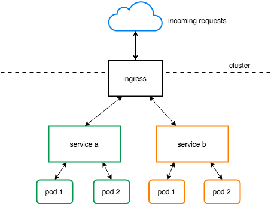
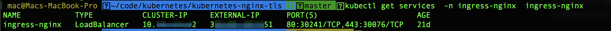

# kubernetes-nginx-tls
Guide to install kubernetes nginx ingress controller with cert-manager

## Pre-requisites

1. Install kubectl
    ```shell
    gcloud components install kubectl
    ```

2. Configure gcloud
   * Create project
        ```shell
        gcloud config configurations create avangers-project
        ```
        You can change the project name <code>avangers-project</code> into any name you want
    * Activate our previouly created project
        ```shell
        gcloud config configurations activate avangers-project
        ```
    * Set the compute zone region
        ```shell
        gcloud config set compute/zone asia-southeast1-a
        ```
        You <code>asia-southeast1-a</code> is region name you can specify any region as your need
    * Initialize all configurations above
        ```shell
        gcloud init
        ```
    Processes above will configure and initalize project into google cloud
3. Check created project
    ```bash
    gcloud config configurations describe avangers-project
    ```

Result above will give output something like this in your terminal
```shell
...
is_active: true
name: avangers-project
properties:
  compute:
    zone: asia-southeast1-a
  core:
    account: xxxxx@gmail.com
    project: avangers-project
```


## Create kubernetes cluster

After project created now we can create our kubernetes clusters 
```shell
gcloud container clusters create staging-avangers --num-nodes=1
```
Note: 
flat --num-nodes can specify with any number of node that you need for your cluster, as this guide is only for example so i create cluster in one node

Check if the cluster is created
```shell
kubectl get pods --all-namespaces
```

## Setup Nginx Ingress

There are a lot of <b>Ingress Controller</b> out there like:
* Contour based on Envoy by Heptio
* Traefik by Containous
* Nginx by Nginx Inc
* Kong by Kong HQ
* etc
  
In this guide we will using nginx as our ingress controller. The simple diagram about ingress controller like in this diagram below that i create to simplify the explanation:

<div style="text-align:center">

</div>


Based on nginx kubernetes official docs <a hreg="https://kubernetes.github.io/ingress-nginx/deploy/" target="_blank">here</a> we can follow simple step to install nginnx ingress controller

### 1. Mandatory Command
The following <b>Mandatory Command</b> is required and cannot be skip
```shell
kubectl apply -f https://raw.githubusercontent.com/kubernetes/ingress-nginx/master/deploy/mandatory.yaml
```

If you chasing error (Forbidden) then you need your user accounnt as admin in the cluster. Execute the following command below if your user is not a cluster adminn
```shell
kubectl create clusterrolebinding cluster-admin-binding --clusterrole cluster-admin --user xxx@gmail.com
```

or if you don't want to type the email account you can type the command below
```shell
kubectl create clusterrolebinding cluster-admin-binding --clusterrole cluster-admin --user $(gcloud config get-value account)
```

### 2. Apply nginx service into the cluster
The command below will apply nginx service into the cluster and can be use for any namespace or service
```shell
kubectl apply -f https://raw.githubusercontent.com/kubernetes/ingress-nginx/master/deploy/provider/cloud-generic.yaml
```

### 3. Check your nginx services
To check our nginx ingress controller installation work well or not we can check with the command below
```shell
kubectl get services  -n ingress-nginx  ingress-nginx
```

If the installation success you wil get output like this



## Create namespace, deployment and service in kubernetes

### 1. Create namespace
The first thing is create a namespace four our application although kubernetes offer namespace named <code>default</code> by default it's more good practice if we define our own namespace based on needs.

In simple way namespace is like a directory that contains all of your application. You can define namespace anything you want but i regularly define namespace based on their env and domain.

I.e if you don't want your namespace become complex you cand define namespace something like this.
Note: this just simple suggestion not official docs
- default
- staging
- production


```yml
apiVersion: v1
kind: Namespace
metadata:
    name: staging
    labels:
        name: staging
```

### 2. Create deployment
Deployment like it called it's containt of deployment spec of the app. In short in this configuration you define any stuff configuration that you need for your app. 

```yml
apiVersion: apps/v1
kind: Deployment
metadata:
    name: ironman-app
    namespaces: staging
spec:
    selector:
        matchLabels:
            app: ironman-app
    strategy:
        type: RollingUpdate
        rollingUpdate:
            maxSurge: 1
            maxUnavailable: 0
    template:
        metadata:
            labels:
                app: ironman-app
            annotations:
                checksum/deployment: TMP_DEP_CHECKSUM
        spec:
            containers: 
                - name: ironman-app
                  image: xxx
                  imagePullPolicy: Always
                  resources:
                    limits:
                        cpu: 100m
                        memory: 64M
                    requests:
                        cpu: 40m
                        memory: 16M
```

### 3. Create service
Service will be use as a service that serve route to the deployment app with given configurations
```yml
kind: Service
apiVersion: v1
metadata:
    name: ironman-app
    namespace: staging
spec:
    type: NodePort
    selector:
        app: ironman-app
    prots:
        - protocol: TCP
          port: 8080
          targetPort: 8080
          name: ironman-app
```

In short because we don't want to make this guide to long you can check the official docs about every key configuration. As a sample there are some configuration NodePort, LoadBalancer, ClusterIp

### 4. Full yml file

The full snipped above combined as one yml file to make it clearer k8s-ironman.yml file

```yml
apiVersion: v1
kind: Namespace
metadata:
    name: staging
    labels:
        name: staging
---
apiVersion: apps/v1
kind: Deployment
metadata:
    name: ironman-app
    namespaces: staging
spec:
    selector:
        matchLabels:
            app: ironman-app
    strategy:
        type: RollingUpdate
        rollingUpdate:
            maxSurge: 1
            maxUnavailable: 0
    template:
        metadata:
            labels:
                app: ironman-app
            annotations:
                checksum/deployment: TMP_DEP_CHECKSUM
        spec:
            containers: 
                - name: ironman-app
                  image: xxx
                  imagePullPolicy: Always
                  resources:
                    limits:
                        cpu: 100m
                        memory: 64M
                    requests:
                        cpu: 40m
                        memory: 16M
---
kind: Service
apiVersion: v1
metadata:
    name: ironman-app
    namespace: staging
spec:
    type: NodePort
    selector:
        app: ironman-app
    prots:
        - protocol: TCP
          port: 8080
          targetPort: 8080
          name: ironman-app
```

Apply the yml file configuration above 
```shell
kubectl apply -f k8s-ironman.yml
```

### 5. Check result
We can check the result be look into pods created after we apply the file above
```shell
kubect get pods -n staging
```

Check deployments
```shell
kubectl get deployments -n staging
```


## Apply Nginx Ingress

After our namespace, deployment and service is running up next we can apply nginx ingress to route into our service
```yml
apiVersion: extensions/v1beta1
kind: Ingress
metadata:
    name: ironman-app
    namespace: staging
    annotations:
        kubernetes.io/ingress.class: nginx
spec:
    rules:
        - host: ironman.yourdomain.com
          http:
            paths:
                - path: /
                  backend:
                    serviceName: ironman-app
                    servicePort: 8080
```

Apply the yml configuration above
```shell
kubectl apply -f ironman-app-ingress.yml
```

Check if the ingress is deployed
```shell
kubectl get ingress -n staging
```

After it deployed you will get ip address for your then setup this ip address into your DNS management

## Setup Cert Manager

We will follow guide from official cert-manager documentation <a href="https://docs.cert-manager.io/en/latest/getting-started/index.html" target="_blank">here</a>

### 1. Craete a namespace for cert-manager
```shell
kubectl create namespace cert-manager
```
Disabling resource validation on the namespace that cert-manager runs in:
```shell
# Disable resource validation on the cert-manager namespace
kubectl label namespace cert-manager certmanager.k8s.io/disable-validation=true
```

### 2. Install cert-manager
```shell
# Install the CustomResourceDefinitions and cert-manager itself
kubectl apply -f https://raw.githubusercontent.com/jetstack/cert-manager/release-0.7/deploy/manifests/cert-manager.yaml
```
Note:
If you are running kubectl v1.12 or below, you will need to add the <code>--validate=false</code> flag to your kubectl apply command above else you will receive a validation error relating to the <code>caBundle</code> field of the <code>ValidatingWebhookConfiguration</code> resource.

### 3. Verifying the installation
Once the cert-manager installed we can verify it is deployed correctly by checking the <code>cert-manager</code> namesapce for running pods:
```shell
kubectl get pods --namespace cert-manager
```

### 4. Create sample app with certificate
```yml
# Create a ClusterIssuer to test the webhook works okay
cat <<EOF > test-resources.yaml
apiVersion: v1
kind: Namespace
metadata:
  name: cert-manager-test
---
apiVersion: certmanager.k8s.io/v1alpha1
kind: Issuer
metadata:
  name: test-selfsigned
  namespace: cert-manager-test
spec:
  selfSigned: {}
---
apiVersion: certmanager.k8s.io/v1alpha1
kind: Certificate
metadata:
  name: selfsigned-cert
  namespace: cert-manager-test
spec:
  commonName: example.com
  secretName: selfsigned-cert-tls
  issuerRef:
    name: test-selfsigned
EOF
```

```shell
# Create the test resources
kubectl apply -f test-resources.yaml
```
